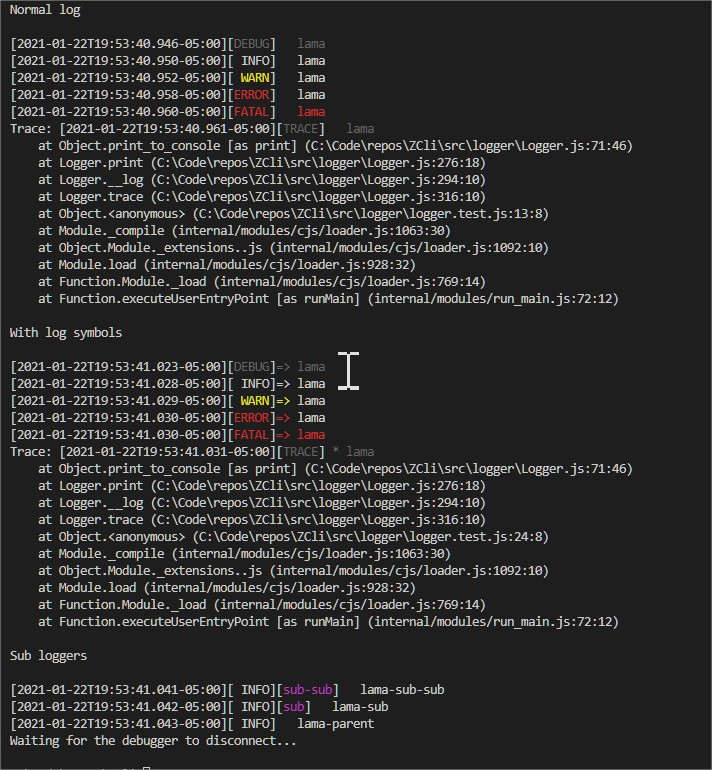

# An advanced cli generator for NodeJs

An efficient, object centric auto generated command line interface.

Package includes:

1. Cli engine, and supporting classes.
2. Internal logger with contexts, common timestamp generation and a colors.
3. [VSCode snippets](vscode_snippets.json)
4. Load and save configuration from/to file.

## BETA

## Install

```shell
npm install lamaani/infer
```

## TL;DR

To define a simple cli,

```javascript
const {Cli} = require('@lamaani/infer')
const cli = new Cli({name: 'my_cli'})

// Add other commands
cli.default(
  async ({arg = null, flag = false}) => {
    console.info('Recived argument: ' + arg)
    console.info('Flag is: ' + flag)
  },
  {
    arg: {
      type: 'named',
      aliases: ['a'],
    },
    flag: {
      type: 'flag',
    },
  }
)

if (require.main == module)
  cli.parse().catch((err) => {
    console.error(err)
    process.exit(err.code || 1)
  })
```

With cascading commands,

```javascript
const Cli = require('@lamaani/infer').Cli
const cli = new Cli({name: 'myapp'})
const myrunner = new MyRunner()

// optional sub menu:
cli.set('run', {}, {description: 'stuff to run'})

// Using a class to define the arguments.
// the command: myapp run class
cli.set('run class', myrunner, {
  description: 'Get options from a class',
  action: (options) => myrunner.run(options),
})

// Directly define the arguments.
cli.set(
  'run special',
  {
    arg: {
      type: 'named',
      aliases: ['a'],
    },
    flag: {
      type: 'flag',
    },
  },
  {
    description: 'run an anonymous action.',
    action: (options) => console.log(JSON.stringify(options, null, 2)),
  }
)

if (require.main == module)
  cli.parse().catch((err) => {
    console.error(err)
    process.exit(err.code || 1)
  })
```

Where MyRunner is,

```javascript
/** @typedef {import('lamaani/infer').CliArgument} CliArgument */

class MyRunner {
  constructor() {
    // arguments that start with __$
    // are cli arguments, and will
    // be set to this object when parsed.

    /** Yet another argument */
    this.arg = 'default value'
    /** @type {CliArgument} */
    this.__$arg = {
      type: 'named',
      enviromentVariable: 'IFR_ARG',
      default: this.arg,
      description: 'Yet another argument',
    }
  }

  run(options) {}
}
```

To show help,

```shell
my_app --help
```

## Commands

In `infer`, all commands are constructed as sentences, an example for a simple command would be,

```
myapp run special case positional_1 --flag --arg val positional_2
```

This above command would be translated to,

```javascript
command_name='myapp run special case'
command_options={
  positional: ['positional_1','positional_2']
  named: {
    flag: true,
    arg: 'val'
  }
}
```

Named arguments or flags are not position dependent, therefore, the
following is equivalent to the above,

```
myapp --flag run special --arg val case positional_1 positional_2
```

### Limitations

1. There are no combined flags, i.e. no `-wWyDt`.
1. Arguments are parsed only as,
   - Single letters: `a` -> `-a`
   - Multi letters: `arg` -> `--arg`
1. Positional arguments are only allowed for the final command, otherwise all positional arguments are parsed as commands.

### Arguments

#### Argument types:

1. `named` - a regular named argument. Any value. `--arg, -a`
2. `flag` - A named argument, but no value (true if exists, in config you must set the value). `--flag, -f`
3. `positional` - An argument that follows the command. Will be added to an array.
4. `env` - An argument that would not appear in the CLI, but rather is only loaded from the
   environment variable. (Can be assigned in config)
5. `overflow` - Catch all for any argument after the positional arguments. Allows
   unknown number of input arguments.
6. `transfer` - Catch any argument after the symbol `--`. This allows separation of command arguments
   from arguments that need transferring to another command.

| Name                | description                                                                                                                                | possible values                                                  | default                                                             |
| ------------------- | ------------------------------------------------------------------------------------------------------------------------------------------ | ---------------------------------------------------------------- | ------------------------------------------------------------------- |
| type                | The argument type                                                                                                                          | `['named', 'flag', 'positional', 'env', 'overflow', 'transfer']` | named                                                               |
| field_name          | The name of the field to update on the parent object                                                                                       | [any]                                                            | The field name in the object                                        |
| match               | The name of the argument to match if `named` or `flag`                                                                                     | [any]                                                            | the field name, where any non letter or number is replaced with `-` |
| default             | the default value.                                                                                                                         | [any]                                                            | [null]                                                              |
| environmentVariable | The matching environment variable. If exits, will be taken instead of default. The env in nodejs will be updated to match the field value. | [string]                                                         | If `env` then the field_name, otherwise null                        |
| aliases             | Array, the possible command aliases                                                                                                        | string[]                                                         | []                                                                  |
| description         | The argument description.                                                                                                                  | [string]                                                         | null                                                                |
| parse               | Method: `(val)=>[any]`. Called before any assignment.                                                                                      | [function]                                                       | null                                                                |
| doNotAssignToParent | If true, dose not assign the argument to its parent.                                                                                       | `true`/`false`                                                   | `false`                                                             |
| doNotAssignToEnv    | If true, dose not assign the argument to the environment variable.                                                                         | `true`/`false`                                                   | `false`                                                             |
| canBeStored         | If true, allows this argument to be stored to disk (will appear in the configuration file)                                                 | `true`/`false`                                                   | `true`                                                              |

## File configuration manager

To add a file configuration manager,

```javascript
const cli = new (require('infer').Cli)()
const fs = require('fs')
const CliConfigCommand = require('zlib-cli/CliConfigCommand')

new CliConfigCommand(
  Cli,
  // command to load the configuration as a javascript object.
  () => require('./my_config.json'),
  // command to save the configuration to file.
  (config) => {
    fs.writeFileSync('./my_config.json', JSON.stringify(config))
  }
)
```

Then,

```shell
# to list
myapp config list
# myapp config get [command with dots] [named/flag]
myapp config get run.special.case arg
$> 48
# myapp config set [command with dots] [named/flag] [val/empty to remove]
myapp config set run.special.case arg 42
```

## Logger

```javascript
const Logger = require('infer').Logger

const logger = new Logger()
const sub_logger = logger.create('sub')
const sub_sub_logger = logger.create('sub-sub')

logger.level = 0
console.log('Normal log')
console.log()
logger.debug('lama')
logger.info('lama')
logger.warn('lama')
logger.error('lama')
logger.fatal('lama')
logger.trace('lama')

console.log()
console.log('With log symbols')
console.log()

logger.debug('lama', '=>')
logger.info('lama', '=>')
logger.warn('lama', '=>')
logger.error('lama', '=>')
logger.fatal('lama', '=>')
logger.trace('lama', '*')

console.log()
console.log('Sub loggers')
console.log()

sub_sub_logger.info('lama-sub-sub')
sub_logger.info('lama-sub')
logger.info('lama-parent')
```

### Example



# Contribution

Are welcome, please post issues or PR's if needed.

# Implementations still missing:

Add an issue (or better submit PR) if you need these.

1. XCom
1. Examples (other than TL;DR)

# Licence

Copyright ©
`Zav Shotan` and other [contributors](graphs/contributors).
It is free software, released under the MIT licence, and may be redistributed under the terms specified in `LICENSE`.
